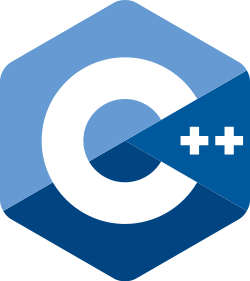

  

<h3 align="center">FT_CONTAINERS: reimplementation of containers from the c++98's STL</h3>

---

  </a>

## 📝 Table of Contents

- [Project's details](#details)
- [Usage](#usage)
- [Tester](#tester)

## 🔬 Project's details 

In this project, students are expected to implement the various container types of the C++ standard
template library.
For each container, one directory containing the headers files.
The namespace used for these containers is `ft` and so containers can be used with `ft::<container>`

It is a C++98 project, so any new feature of the containers are not implemented, but every old feature (even deprecated) are.

The containers are: 

- Vector
- Stack
- Map
- List

Bonus part :
- Set
- Deque
- Queue

These containers are supposed to work and behave the same way as the originals, preferably with the same data structure implementation. They also are expected to have the same public member function.

## 👩‍💻 Usage 

- `make` will sync the tester sub-module and place the FT_CONTAINERS header files at the right location and then run the tester.

## 🔬 Tester 

This project already includes the following tester as a sub-module, so it can be run with a simple `make`

    <a href="https://github.com/42f/FT_CONTAINERS_42_tester">

 
    </a>

